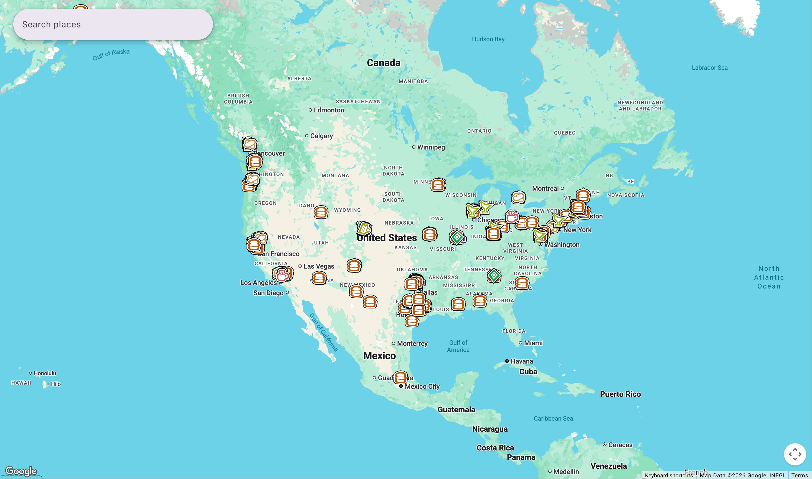
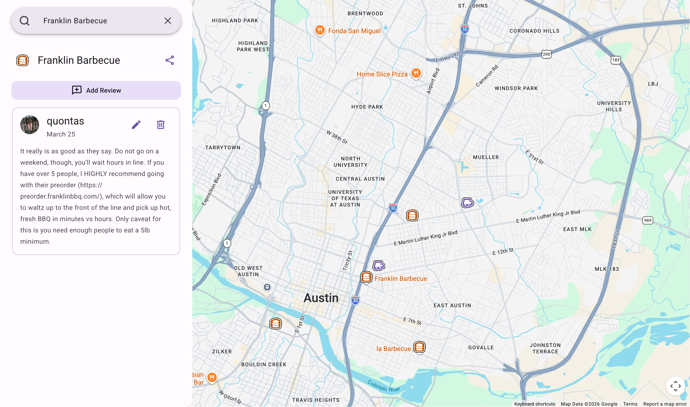

# Salt Cellar Map

A Discord-gated web app for Salt Cellar members to discover, submit, and review food & drink venues on an interactive map.

Access is tied to Discord guild membership. Members can browse and submit places; "Goated" role holders get permanent lifetime access.

## Tech Stack

- **Framework**: SvelteKit (SSR + API routes)
- **Runtime**: Bun
- **Database**: PostgreSQL 17
- **Auth**: Discord OAuth with HMAC-signed session cookies
- **Reverse proxy**: nginx (Docker) / Traefik (production)

## Getting Started

See [CONTRIBUTING.md](./CONTRIBUTING.md) for prerequisites, local development setup, and how to contribute.

## Documentation

- [CONTRIBUTING.md](./CONTRIBUTING.md) — local setup and contribution guide
- [DESIGN_DOC.md](./DESIGN_DOC.md) — architecture decisions and data model
- [AGENTS.md](./AGENTS.md) — tooling list and code quality rules
